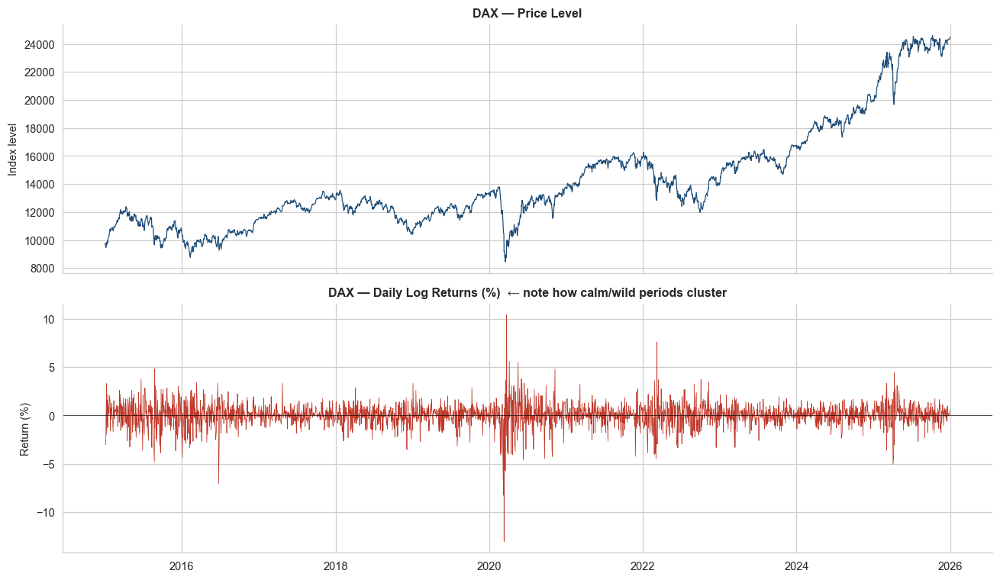
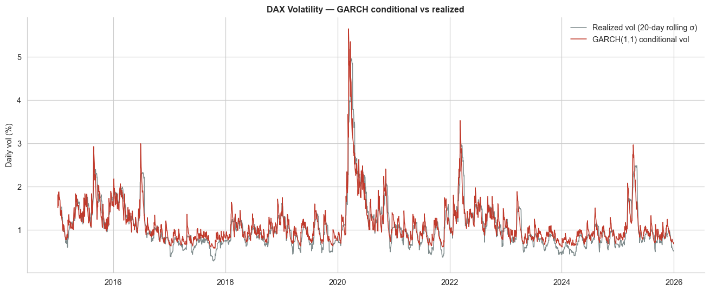
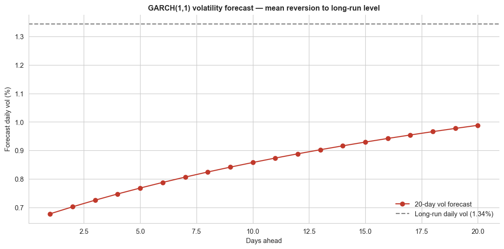
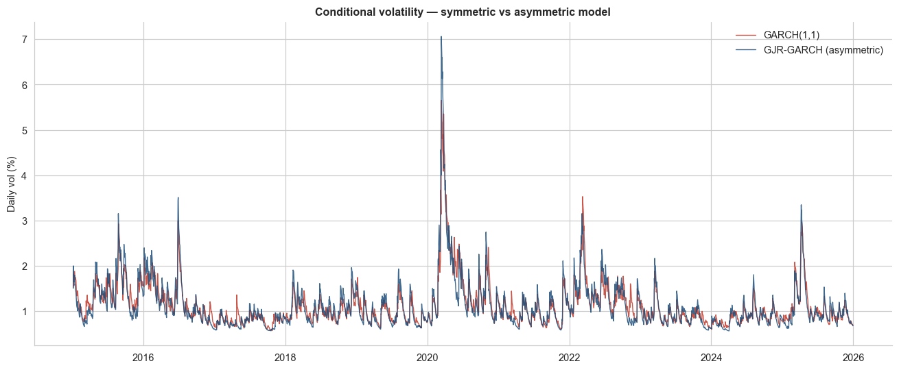

# DAX Volatility Modeling with GARCH

End-to-end volatility modeling pipeline for the German DAX index. Detects ARCH effects, fits **GARCH(1,1)** with Student-t innovations, forecasts forward volatility, computes parametric Value-at-Risk, and benchmarks against an asymmetric **GJR-GARCH** model to capture the leverage effect.

Part of a CFA Level II quant methods study series — taking concepts from the curriculum (heteroskedasticity, AR models, unit root tests, conditional volatility) and applying them to live German equity data.



---

## Key Findings

| Metric | Value | Interpretation |
|---|---|---|
| Sample | Jan 2015 – Dec 2025 (2,789 days) | ~11 years of daily data |
| Mean daily return | 0.033% | ~8.3% annualized |
| Daily std | 1.20% | ~19.1% annualized |
| Skewness | −0.60 | Left-tail risk (crashes > rallies) |
| Excess kurtosis | 7.28 | Massive fat tails (normal = 0) |
| Student-t ν | 5.21 | Confirms fat tails — normal assumption would underestimate risk |
| α (shock reaction) | 0.137 | New shock impact on next-day variance |
| β (persistence) | 0.838 | Yesterday's variance carries forward strongly |
| **α + β** | **0.9748** | **Shock half-life ≈ 27 trading days** |
| Long-run annual vol | 21.3% | Model-implied steady-state, matches stylized fact |
| 1-day 95% VaR | 1.27% | ~€1,270 expected loss per €100k exposure, ~1 day in 20 |
| GJR-GARCH γ | 0.207 | **Leverage effect confirmed** — bad news ≈ 2.5× worse than good news of equal size for next-day vol |
| AIC improvement (GJR vs GARCH) | −75 | Decisive evidence asymmetry matters |

---

## Methodology

1. **Data** — daily `^GDAXI` close prices via `yfinance`; log returns scaled ×100
2. **Stationarity** — Augmented Dickey-Fuller test on returns (rejects unit root, as theory predicts)
3. **ARCH diagnosis** — AR(1) on returns, then Ljung-Box on *squared* residuals (strong rejection of no-ARCH → GARCH is justified, not assumed)
4. **GARCH(1,1)** — Maximum likelihood estimation with Student-t innovations to handle fat tails
5. **In-sample fit** — conditional volatility series overlaid with 20-day realized vol
6. **Out-of-sample forecast** — 20-day-ahead conditional volatility path, illustrating mean reversion to the long-run level
7. **Value-at-Risk** — 1-day 95% parametric VaR using the fitted Student-t quantile (not a normal z-score)
8. **GJR-GARCH** — asymmetric extension; compares information criteria and conditional vol series

---

## Results

### Volatility clustering is visible in raw returns

The bottom panel shows what motivates the entire exercise: returns aren't homoskedastic. Calm and stormy periods cluster — exactly the assumption violation Lesson 4 (heteroskedasticity) describes.

### GARCH tracks realized volatility closely



The GARCH(1,1) conditional volatility (red) closely follows the 20-day rolling realized volatility (gray) — including all three major regime shifts (COVID 2020, Russia/Ukraine 2022, the April 2025 spike).

### Forecasts mean-revert to the long-run level



Because current volatility (~0.68%) is *below* the long-run level (1.34%), the GARCH forecast pulls **upward** over the 20-day horizon. This is the textbook mean reversion behavior — but the direction surprises people who expect "forecast" to mean "going down from a spike."

### GJR-GARCH captures asymmetry that GARCH misses



During the March 2020 crash, GJR-GARCH peaks near 7% daily vol while symmetric GARCH only reaches ~5.4%. The asymmetric model "knows" that negative shocks have outsized impact on next-day variance — confirmed by γ = 0.207 and a 75-point AIC improvement.

---

## Project Structure

```
dax-volatility-garch/
├── README.md
├── requirements.txt
├── .gitignore
├── dax_garch_analysis.py        # full pipeline (run end-to-end)
└── plots/
    ├── 01_price_and_returns.png
    ├── 02_garch_vs_realized.png
    ├── 03_vol_forecast.png
    └── 04_garch_vs_gjr.png
```

---

## How to Run

```bash
# Clone
git clone https://github.com/<your-username>/dax-volatility-garch.git
cd dax-volatility-garch

# Set up environment
python -m venv .venv
source .venv/bin/activate          # Windows: .venv\Scripts\activate
pip install -r requirements.txt

# Run the full pipeline
python dax_garch_analysis.py
```

Plots regenerate into `plots/`. Console prints all diagnostics, coefficients, and the VaR estimate.

---

## Limitations & Caveats

- **Parametric VaR** assumes the Student-t distribution holds in the tail. Backtesting (e.g., Kupiec or Christoffersen tests) is the next step before trusting it in production.
- **Backward-looking model**. GARCH uses only historical returns — no options-implied information (VDAX-NEW). A useful extension would benchmark forecasts against the implied vol surface.
- **Single asset**. Univariate GARCH ignores cross-asset spillovers. Multivariate (DCC-GARCH, BEKK) would capture co-movement.
- **No structural breaks** explicitly modeled. The 2020 regime shift likely affects parameter stability (Lesson 9 — instability of regression coefficients) and could be tested with rolling-window estimation.

---

## Tech Stack

- **Python 3.10+**
- `arch` — Kevin Sheppard's GARCH/EGARCH/GJR library
- `statsmodels` — ADF, Ljung-Box, ARIMA
- `yfinance` — DAX price data
- `scipy` — Student-t quantile for VaR
- `pandas`, `numpy`, `matplotlib`

---

## References

- Bollerslev, T. (1986). *Generalized Autoregressive Conditional Heteroskedasticity*. Journal of Econometrics, 31(3), 307–327.
- Glosten, L. R., Jagannathan, R., & Runkle, D. E. (1993). *On the Relation between the Expected Value and the Volatility of the Nominal Excess Return on Stocks*. Journal of Finance, 48(5), 1779–1801.
- CFA Institute. *Quantitative Methods* curriculum — Time-Series Analysis readings.

---

## Author

Ziya Utku Karadeniz — linkedin.com/in/ziyautkukaradeniz

Part of an ongoing series applying CFA Level II quantitative methods to real market data.
